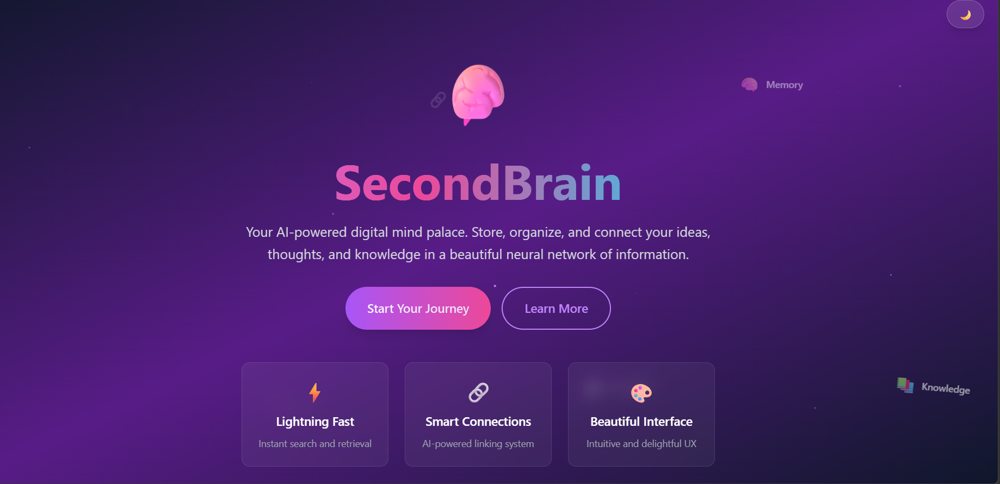
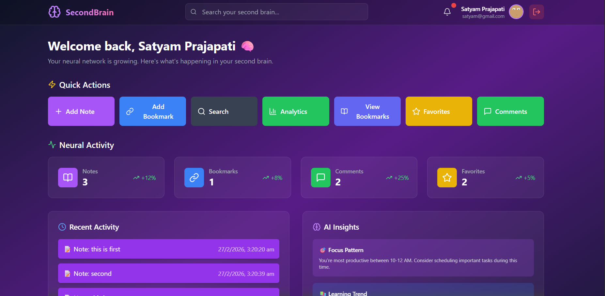
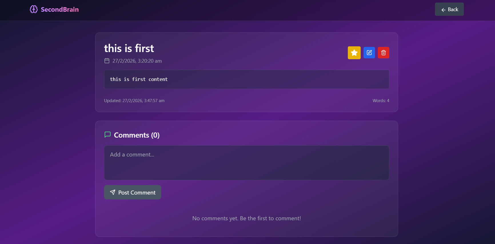
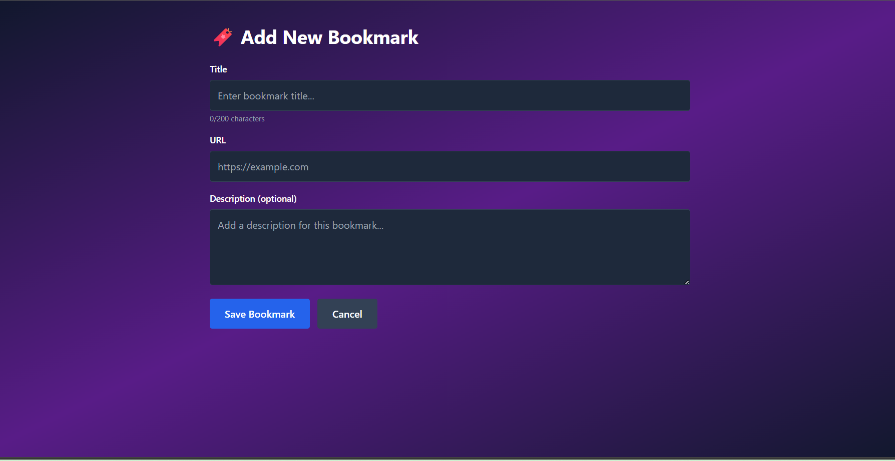
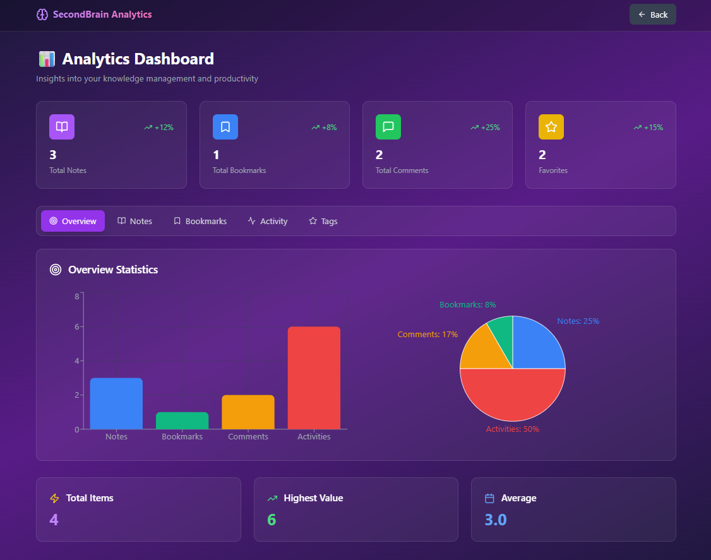
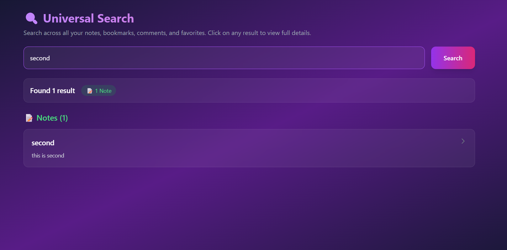

#  Second Brain

A comprehensive knowledge management system that helps you organize, store, and retrieve your thoughts, notes, and bookmarks efficiently. Built with modern web technologies for a seamless user experience.

[](https://second-brain-project.vercel.app/)
[](https://github.com/satyam0777/Second-Brain-Project)

## 🌐 Links

- **Live Application**: [https://second-brain-project.vercel.app/](https://second-brain-project.vercel.app/)
- **GitHub Repository**: [https://github.com/satyam0777/Second-Brain-Project](https://github.com/satyam0777/Second-Brain-Project)

##  Features

- **Notes Management**: Create, edit, organize, and search your notes with a rich text interface
- **Bookmarks**: Save and categorize web links for easy access
- **Favorites**: Mark important notes and bookmarks for quick retrieval
- **Comments**: Add context and thoughts to your saved content
- **Analytics**: Visualize your knowledge base with interactive charts and insights
- **Advanced Search**: Find anything quickly with powerful search functionality
- **Activity Tracking**: Monitor your productivity and usage patterns
- **Modern UI**: Clean, responsive interface built with Tailwind CSS and Framer Motion
- **Secure Authentication**: JWT-based authentication system
- **Dashboard**: Get an overview of your entire knowledge base at a glance

## Tech Stack

### Frontend
- **React 19** - Modern UI library
- **Vite** - Fast build tool and dev server
- **Tailwind CSS 4** - Utility-first CSS framework
- **React Router Dom** - Client-side routing
- **Framer Motion** - Smooth animations
- **Axios** - HTTP client
- **Recharts** - Data visualization
- **Lucide React** - Beautiful icons

### Backend
- **Node.js** - JavaScript runtime
- **Express** - Web framework
- **MongoDB** - NoSQL database
- **Mongoose** - MongoDB ODM
- **JWT** - Authentication tokens
- **bcryptjs** - Password hashing

##  Project Structure

```
second-brain/
├── frontend/                # React frontend application
│   ├── src/
│   │   ├── components/     # Reusable UI components
│   │   ├── pages/          # Page components
│   │   ├── api/            # API integration layer
│   │   └── assets/         # Static assets
│   └── public/             # Public files
│
├── SecondBrain-backend/    # Express backend server
│   ├── config/             # Configuration files
│   ├── controllers/        # Route controllers
│   ├── models/             # Database models
│   ├── routes/             # API routes
│   ├── middleware/         # Custom middleware
│   └── utils/              # Utility functions
│
└── docs/                   # Documentation
```

##  Getting Started

### Prerequisites

- Node.js (v16 or higher)
- MongoDB (local or Atlas)
- npm or yarn

### Installation

1. **Clone the repository**
   ```bash
   git clone https://github.com/satyam0777/Second-Brain-Project.git
   cd Second-Brain-Project
   ```

2. **Setup Backend**
   ```bash
   cd SecondBrain-backend
   npm install
   ```

   Create a `.env` file in the backend directory:
   ```env
   PORT=5000
   MONGODB_URI=your_mongodb_connection_string
   JWT_SECRET=your_jwt_secret_key
   NODE_ENV=development
   ```

3. **Setup Frontend**
   ```bash
   cd frontend
   npm install
   ```

   Create a `.env` file in the frontend directory:
   ```env
   VITE_API_URL=http://localhost:5000
   ```

### Running the Application

1. **Start the Backend Server**
   ```bash
   cd SecondBrain-backend
   npm run dev
   ```
   The server will run on `http://localhost:5000`

2. **Start the Frontend Development Server**
   ```bash
   cd frontend
   npm run dev
   ```
   The application will run on `http://localhost:5173`

3. **Open your browser** and navigate to `http://localhost:5173`

##  Environment Variables

### Backend (.env)
| Variable | Description | Required |
|----------|-------------|----------|
| PORT | Server port number | Yes |
| MONGODB_URI | MongoDB connection string | Yes |
| JWT_SECRET | Secret key for JWT tokens | Yes |
| NODE_ENV | Environment mode | Yes |

### Frontend (.env)
| Variable | Description | Required |
|----------|-------------|----------|
| VITE_API_URL | Backend API URL | Yes |

##  API Documentation

The backend provides the following API endpoints:

- **Authentication**: `/api/auth` - Register, login, logout
- **Notes**: `/api/notes` - CRUD operations for notes
- **Bookmarks**: `/api/bookmarks` - Manage bookmarks
- **Comments**: `/api/comments` - Add and manage comments
- **Favorites**: `/api/favorites` - Mark/unmark favorites
- **Dashboard**: `/api/dashboard` - Dashboard statistics
- **Analytics**: `/api/analytics` - Usage analytics
- **Search**: `/api/search` - Global search
- **Activity**: `/api/activity` - Activity logs

##  Screenshots

### Landing Page


### Dashboard


### Notes Management


### Bookmarks


### Analytics


### Search


##  Contributing

Contributions are welcome! Please feel free to submit a Pull Request.

1. Fork the project
2. Create your feature branch (`git checkout -b feature/AmazingFeature`)
3. Commit your changes (`git commit -m 'Add some AmazingFeature'`)
4. Push to the branch (`git push origin feature/AmazingFeature`)
5. Open a Pull Request

##  License

This project is licensed under the MIT License.

##  Author

**Satyam Prajapati**

- GitHub: [@satyam0777](https://github.com/satyam0777)

##  Acknowledgments

- React team for the amazing framework
- Tailwind CSS for the utility-first CSS framework
- MongoDB for the database solution
- Vercel for hosting the application

---

Made with ❤️ by Satyam Prajapati
